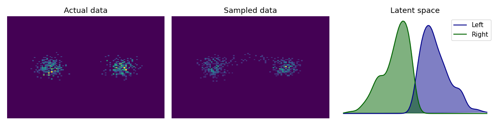

### Variational Autoencoders

Last update: December 2022.

---

The VAE models a latent variable $\mathbf{z}$ and an observed variable $\mathbf{x}$.

```math
\begin{equation*}
\mathbf{z}\rightarrow \mathbf{x}
\end{equation*}
```

We assume a forward model parameterized by $\theta$, and a backward "approximate posterior" model by $\phi$.

```math
\begin{align*}
p_\theta(\mathbf{x}, \mathbf{z}) & = p_\theta(\mathbf{z})p_\theta(\mathbf{x}|\mathbf{z}) & q_\phi(\mathbf{z}|\mathbf{x}) & \approx p_\theta(\mathbf{z}|\mathbf{x})
\end{align*}
```
To explain the optimization process, it's easier to examine the general case of maximizing the marginal likelihood in a latent-variable model.

**The Evidence Lower Bound**

Consider maximizing the likelihood of observed variables $\mathbf{x}$ with latent variables $\mathbf{z}$, with a model $\theta$.

This comes up in many situations, not only in the context of VAEs. Examples:

- Clustering: $\mathbf{x}$ is observations, $\mathbf{z}$ are membership identities.
- Bayesian inference: $\mathbf{x}$ is observations, $\mathbf{z}$ are model parameters.

It's easy to hypothesize a model $p_\theta(\mathbf{x}|\mathbf{z})$. But typically a closed-form model for the *posterior* of the latent variables is intractable due to the dimensionality of $\mathbf{z}$. That is, it's impossible to compute the following.
```math
p_\theta(\mathbf{z}|\mathbf{x})=\frac{p(\mathbf{x},\mathbf{z})}{\int_\mathbf{z}p(\mathbf{x},\mathbf{z})d\mathbf{z}}
```
What can we do?

**Property 1**. The Evidence Lower Bound (ELBO), soon to be defined, is a valid lower bound on the marginal likelihood.

Thanks to Jensen's inequality we have the following result on the marginal likelihood.
```math
\begin{align*}
\log p_\theta(\mathbf{x}) & = \log \int_\mathbf{z} p_\theta(\mathbf{x},\mathbf{z})d\mathbf{z}\\
& = \log \int_\mathbf{z}p_\theta(\mathbf{z})p_\theta(\mathbf{x}|\mathbf{z})d\mathbf{z}\\
& \geq \int_\mathbf{z} p_\theta(\mathbf{z})\log p_\theta(\mathbf{x}|\mathbf{z})d\mathbf{z}\\
& =\mathbb{E}_{\mathbf{z}\sim p_\theta(\mathbf{z})}[\log p_\theta(\mathbf{x}|\mathbf{z})]
\end{align*}
```

Following similar logic, there is a bound that arises if we plug in *any* valid distribution $q_\phi(\mathbf{z}|\mathbf{x})$ with parameters $\phi$. (Personally I find it easier to understand the equations below with $q_\phi(\mathbf{z}|\mathbf{x})$ substituted with $q_\phi(\mathbf{z})$ i.e. an unconditional distribution. It really doesn't matter whether it's conditioned on $\mathbf{x}$ or not.)
```math
\begin{align*}
\log p_\theta(\mathbf{x}) & = \log \int_\mathbf{z} q_\phi(\mathbf{z}|\mathbf{x})\frac{p_\theta(\mathbf{x},\mathbf{z})}{q_\phi(\mathbf{z}|\mathbf{x})}d\mathbf{z}\\
& \geq \int_\mathbf{z} q_\phi(\mathbf{z}|\mathbf{x}) \log \frac{p_\theta(\mathbf{x},\mathbf{z})}{q_\phi(\mathbf{z}|\mathbf{x})}d\mathbf{z}\\
& = \mathbb{E}_{\mathbf{z}\sim q_\phi(\mathbf{z}|\mathbf{x})}[\log p_\theta(\mathbf{x},\mathbf{z})]+ H(q_\phi(\mathbf{z}|\mathbf{x})) \\
& = \mathbb{E}_{\mathbf{z}\sim q_\phi(\mathbf{z}|\mathbf{x})}[\log p_\theta(\mathbf{x}|\mathbf{z})]+\mathbb{E}_{\mathbf{z}\sim q_\phi(\mathbf{z}|\mathbf{x})}[\log p_\theta(z)]+H(q_\phi(\mathbf{z}|\mathbf{x}))\\
&= \mathbb{E}_{\mathbf{z}\sim q_\phi(\mathbf{z}|\mathbf{x})}[\log p_\theta(\mathbf{x}|\mathbf{z})] -D_\mathrm{KL}(\ q_\phi(\mathbf{z}|\mathbf{x})\ \|\ p_\theta(\mathbf{z})\ )\\
& \triangleq \mathcal{L}_{\theta,\phi}(\mathbf{x})
\end{align*}
```
The last three lines are all equivalent forms of the ELBO.

**Property 2**. The gap between the marginal likelihood and the ELBO is exactly the KL divergence between the true intractable posterior $p_\theta(\mathbf{z}|\mathbf{x})$ and the approximated posterior $q_\phi(\mathbf{z}|\mathbf{x})$.

Let's compute the gap between the marginal likelihood and the ELBO.
```math
\begin{align*}
\log p_\theta(\mathbf{x}) - \mathcal{L}_{\theta,\phi}(\mathbf{x})
& = \log \int_\mathbf{z} p_\theta(\mathbf{x},\mathbf{z}) d\mathbf{z} -  \int_\mathbf{z} q_\phi(\mathbf{z}|\mathbf{x}) \log \frac{p_\theta(\mathbf{x})p_\theta(\mathbf{z}|\mathbf{x})}{q_\phi(\mathbf{z}|\mathbf{x})}d\mathbf{z}\\
& = \log \int_\mathbf{z} p_\theta(\mathbf{z}|\mathbf{x}) d\mathbf{z} + \log p_\theta(\mathbf{x}) -  \int_\mathbf{z} q_\phi(\mathbf{z}|\mathbf{x}) \log \frac{p_\theta(\mathbf{z}|\mathbf{x})}{q_\phi(\mathbf{z}|\mathbf{x})}d\mathbf{z} - \log p_\theta(\mathbf{x})\\
& = \log \int_\mathbf{z} p_\theta(\mathbf{z}|\mathbf{x}) d\mathbf{z}  -  \int_\mathbf{z} q_\phi(\mathbf{z}|\mathbf{x}) \log \frac{p_\theta(\mathbf{z}|\mathbf{x})}{q_\phi(\mathbf{z}|\mathbf{x})}d\mathbf{z} \\
& = D_\mathrm{KL}(\ q_\phi(\mathbf{z}|\mathbf{x})\ \|\ p_\theta(\mathbf{z}|\mathbf{x})\ ) \geq 0
\end{align*}
```
So by maximizing the ELBO, we're actually optimizing how well we approximate the intractable posterior!

Note that by invoking the non-negativity of KL divergence, this derivation yields another proof of Property 1 (though in my opinion it's a less intuitive way to achieve the same result).

**The Reparameterization Trick**

A traditional variational auto-encoder makes the following choices:

1. The distribution $p_\theta(\mathbf{x}|\mathbf{z}) \sim N(\boldsymbol\mu,\boldsymbol\Sigma)$ where $\boldsymbol\mu,\boldsymbol\Sigma$ are output by an "encoder" neural network dependent on $\mathbf{z}$.
2. The distribution $q_\phi(\mathbf{z}|\mathbf{x}) \sim N(\boldsymbol\mu,\boldsymbol\Sigma)$ where $\boldsymbol\mu,\boldsymbol\Sigma$ are output by a "decoder" neural network dependent on $\mathbf{x}$.
3. The distribution $p_\theta(\mathbf{z}) \sim N(\mathbf{0},\mathbf{I})$  and is typically fixed and not learned.

There are a variety of noise assumptions on $\boldsymbol\Sigma$ we can choose, in this codebase we fully factorized covariance matrices throughout i.e. every predicted $\boldsymbol\Sigma  = \mathrm{diag}(\sigma^2_d)$. For details see [[this repository]](https://github.com/tonyduan/mdn#mixture-density-network). Note that if we fix $\boldsymbol\Sigma = \mathbf{I}$ then the reconstruction term is exactly the mean squared error of the reconstruction compared to the groundtruth.

To optimize we perform gradient descent on the last of the equivalent versions of the ELBO.
```math
\mathcal{L}_{\theta,\phi}(\mathbf{x}) = \underbrace{\mathbb{E}_{\mathbf{z}\sim q_\phi(\mathbf{z}|\mathbf{x})}[\log p_\theta(\mathbf{x}|\mathbf{z})]}_\text{reconstruction term} - \underbrace{D_\mathrm{KL}(q_\phi(\mathbf{z}|\mathbf{x})\ \|\ p_\theta(\mathbf{z}))}_\text{KL divergence term}
```
The KL divergence term has a closed form solution (between two Gaussians), and therefore a closed-form gradient. But it's not obvious how to best compute the reconstruction term for gradient descent.

There are two "tricks" to do so. Let's again look at the general case first: our goal is to compute
```math
\begin{align*}
\nabla_\theta \mathbb{E}_{\mathbf{u}\sim p_\theta(\mathbf{u})}[f(\mathbf{u})]
\end{align*}
```
**Trick 1.** The log-derivative trick (aka "REINFORCE"). Recall that for any function $g$,
```math
\nabla_\mathbf{u} \log g(\mathbf{u}) = \frac{\nabla_\mathbf{u} g(\mathbf{u})}{g(\mathbf{u})}
```
Then we can derive the following Monte Carlo gradient estimate.
```math
\begin{align*}
\nabla_\theta \mathbb{E}_{\mathbf{u} \sim p_\theta(\mathbf{u})}[f(\mathbf{u})] & = \nabla_\theta \int_\mathbf{u}p_\theta(\mathbf{u}) f_(\mathbf{u})d\mathbf{u}\\

& = \int_\mathbf{u}p_\theta(\mathbf{u})\frac{\nabla_\theta p_\theta(\mathbf{u})}{p_\theta(\mathbf{u})}f(\mathbf{u})d\mathbf{u}\\
& = \int_\mathbf{u}p_\theta(\mathbf{u})\nabla_\theta \log p_\theta(\mathbf{u}) f(\mathbf{u}) d\mathbf{u}\\
& = \mathbb{E}_{\mathbf{u}\sim p_\theta(\mathbf{u})}[\nabla_\theta \log p_\theta(\mathbf{u}) f(\mathbf{u})]\\
& \approx \frac{1}{K}\sum_{k=1}^K \nabla_\theta \log p_\theta(\mathbf{u}^{(k)}) f(\mathbf{u}^{(k)})
\end{align*}
```
**Trick 2**. The reparameterization trick. Suppose we can re-write the sampling process as
```math
\begin{align*}
\mathbf{u} & \sim p_\theta(\mathbf{u}) & & \iff&  \mathbf{u} = g_\theta(\boldsymbol\epsilon), \boldsymbol\epsilon \sim p(\boldsymbol\epsilon).
\end{align*}
```
For example, in the case of a Normal distribution it's well known that
```math
\begin{align*}
\mathbf{u} & \sim N(\boldsymbol\mu,\boldsymbol\Sigma) & & \iff&  \mathbf{u} = \mathbf{L}\boldsymbol\epsilon + \boldsymbol\mu, \boldsymbol\epsilon \sim N(\mathbf{0},\mathbf{I}) \text{ where } \mathbf{L}\mathbf{L}^\top = \boldsymbol\Sigma.
\end{align*}
```
Then we can derive the following Monte Carlo gradient estimate.
```math
\begin{align*}
\nabla_\theta \mathbb{E}_{\mathbf{u}\sim p_\theta(\mathbf{u})}[f(\mathbf{u})] & = \nabla_\theta \mathbb{E}_{\boldsymbol\epsilon \sim p(\boldsymbol\epsilon)}\left[f\left(g_\theta(\boldsymbol\epsilon)\right)\right]\\
&= \mathbb{E}_{\boldsymbol\epsilon \sim p(\boldsymbol\epsilon)}[\nabla_\theta f\left(g_\theta(\boldsymbol\epsilon)\right)]\\
& \approx \frac{1}{K}\sum_{k=1}^K \nabla_\theta f(g_\theta(\boldsymbol\epsilon^{(k)}))
\end{align*}
```
The use of this estimator was the primary innovation of [1].

Putting it together in the context of VAEs, we use this trick to write $q_\phi(\mathbf{z}|\mathbf{x})$ with a re-parameterization.
```math
\begin{align*}
\mathbf{z} & = \mu_\phi(\mathbf{x}) + L_\phi(\mathbf{x})\boldsymbol\epsilon
\end{align*}
```

Then we can write the gradient as the following, which optimizes easily with stochastic gradient descent.
```math
\begin{align*}
\nabla_{\theta,\phi}\mathcal{L}_{\theta,\phi}(\mathbf{x})& =\nabla_{\theta,\phi} \left(\mathbb{E}_{\mathbf{z}\sim q_\phi(\mathbf{z}|\mathbf{x})}[\log p_\theta(\mathbf{x}|\mathbf{z})] - D_\mathrm{KL}(\ q_\phi(\mathbf{z}|\mathbf{x})\ \|\ p_\theta(\mathbf{z})\ )\right)\\
& = \mathbb{E}_{\boldsymbol\epsilon\sim p(\boldsymbol\epsilon)}\left[\nabla_{\theta,\phi}\underbrace{\log p_\theta\left(\mathbf{x}|\mu_\phi(\mathbf{x}) + L_\phi(\mathbf{x})\boldsymbol\epsilon\right)}_\text{reconstruction term}\right] - \nabla_{\theta,\phi}\underbrace{D_\mathrm{KL}\left(\ q_\phi(\mathbf{z}|\mathbf{x})\ \|\ p_\theta(\mathbf{z}) \ \right)}_\text{KL divergence term}
\end{align*}
```

#### Examples

See the `examples/` folder for examples. Below we show the learned latent representation and forward samples for a mixture of Gaussians, with a standard normal prior.



Additionally we try to reconstruct digits.


#### References

[1] D. P. Kingma & M. Welling, Auto-Encoding Variational Bayes. *International Conference on Learning Representations* (2014).
